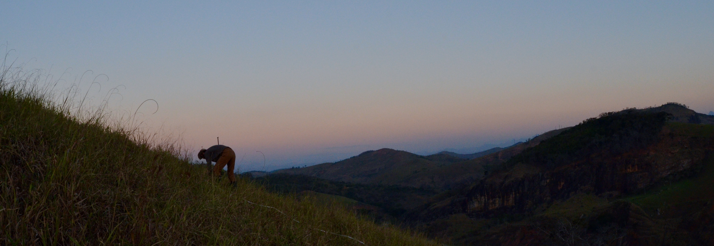

---
---
  

I am an ecosystem biogeochemist working at Boise State University, and as a visiting scientist at the USGS Forest, Rangeland, and Ecosystem Science Center. Currently a post doctoral scholar, my work seeks to evaluate the impacts of climate change across the landscape by merging soil science with plant physiological ecology. My research connects above and below ground drivers and responses to climate change to study nutrient and water cycling across forest, and rangeland ecosystems. I specialize in applying methods from my background in analytical chemistry in coordination with statistical models and geospatial analysis to connect site level information with remotely sensed and modeled data. By doing so, my research connects site level phenomena to landscape scale processes to better understand drivers of ecological patterns and how they are shifting with climate change across scales.

<iframe width="560" height="315" allign = "center" src="https://www.youtube.com/embed/lDVFHbUV7z4" frameborder="0" allow="autoplay; encrypted-media" allowfullscreen></iframe>
Me in my ideal setting, thinking about science in the middle of the grand canyon!
